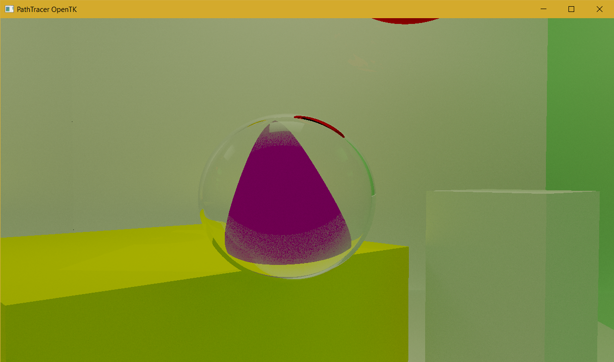

# PathTracerOpenTK

## Описание
PathTracerOpenTK — это приложение для трассировки путей лучей (Path Tracing), разработанное с использованием библиотеки OpenTK для C#. Проект представляет собой реализацию метода рендеринга с глобальным освещением, позволяющего создавать фотореалистичные изображения 3D-сцены.

## Особенности
- Реализация алгоритма трассировки путей на GPU с использованием шейдеров GLSL
- Интерактивная камера с возможностью свободного перемещения по сцене
- Поддержка различных геометрических примитивов (сферы, параллелепипеды, тетраэдры)
- Реалистичные материалы с настройками отражения, шероховатости и прозрачности
- Аккумуляция семплов для постепенного улучшения качества рендеринга

## Системные требования
- .NET 8.0 или выше
- Поддержка OpenGL 4.6
- Графический процессор с поддержкой CUDA (настроен для использования GPU 0)

## Установка и запуск
1. Убедитесь, что у вас установлена платформа .NET 8.0
2. Клонируйте репозиторий:
   ```
   git clone https://github.com/Ruslan361/PathTracerOpenTK.git
   cd PathTracerOpenTK
   ```
3. Скомпилируйте проект:
   ```
   dotnet build
   ```
4. Запустите приложение:
   ```
   dotnet run
   ```

## Управление
- **W, A, S, D** - перемещение камеры вперед, влево, назад, вправо
- **Space, Shift** - перемещение камеры вверх, вниз
- **Мышь** - поворот камеры


## Структура проекта
- **Program.cs** - точка входа в приложение
- **PathTracingApplication.cs** - основной класс приложения, содержащий логику инициализации OpenGL и главный цикл рендеринга
- **Camera.cs** - класс для управления камерой и вычисления матрицы вида
- **Shader.cs** - класс для загрузки и компиляции шейдеров
- **Resources/** - директория с GLSL-шейдерами:
  - **path_tracing.glsl** - основной шейдер трассировки путей
  - **post_process.glsl** - шейдер постобработки изображения

## Технические детали
Приложение использует метод трассировки путей для создания реалистичного освещения. Основные этапы работы:
1. Генерация лучей из камеры через каждый пиксель экрана
2. Трассировка лучей по сцене с отслеживанием их взаимодействия с объектами
3. Расчет освещения с учетом прямого и непрямого освещения
4. Аккумуляция результатов в текстуру для постепенного улучшения качества
5. Постобработка финального изображения

## Зависимости
- [OpenTK 4.8.2](https://github.com/opentk/opentk) - обертка .NET над OpenGL, предоставляющая доступ к низкоуровневым графическим функциям

## Лицензия
[MIT](LICENSE)


